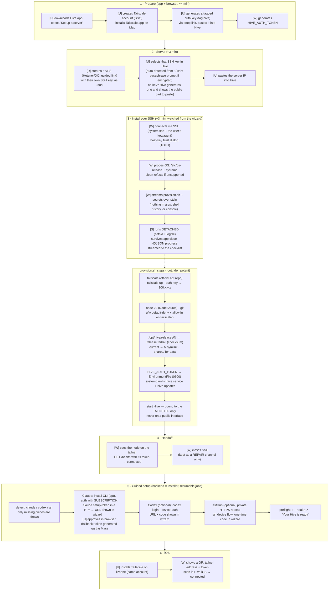
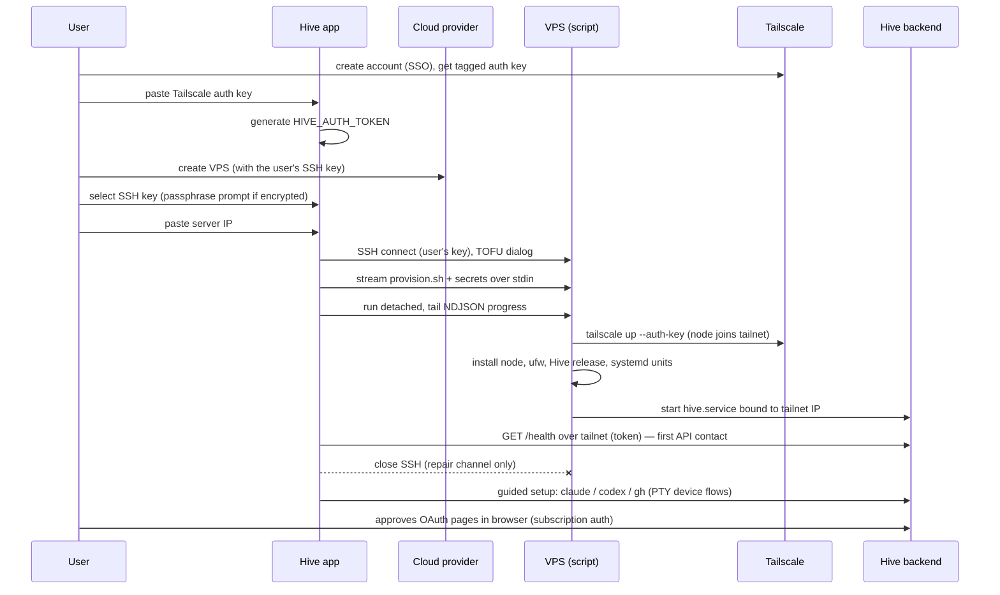
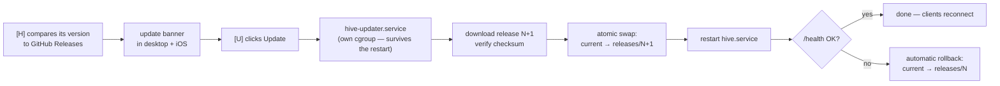

# Hive Install Flow — Design

**Status: design proposal, not yet implemented.** This document describes the target
installation and configuration flow for open-source Hive. Today's manual setup is
documented in [GETTING_STARTED.md](../GETTING_STARTED.md) and [deploy/README.md](../deploy/README.md).

## Goals

1. **Zero terminal for the user.** The entire installation is driven from the Hive
   desktop app. The user never types a shell command.
2. **Minimal extra steps.** Beyond downloading the app, the user only: creates a
   Tailscale account, creates a VPS at a cloud provider, selects the SSH key that
   has access to it, and pastes two strings (Tailscale auth key, server IP).
3. **Subscriptions, not API keys.** Claude and Codex authenticate with the user's
   existing consumer subscription (Claude Pro/Max, ChatGPT Plus/Pro). Hive never
   asks for a pay-per-use API key.
4. **Never publicly exposed.** The backend binds to the Tailscale interface from
   its first second. No port is ever reachable from the public internet, so there
   is no setup-window attack surface (the class of bug behind the Portainer
   first-run takeover CVE and the OpenClaw mass-exposure incident).
5. **One script, simple tech.** A single idempotent `provision.sh` does all
   server-side work. The desktop app is a thin driver. Fewer moving parts means
   fewer bugs on unusual servers.

## Actors

| Tag | Actor | Runs where |
|---|---|---|
| `[U]` | User | Mac/PC, iPhone, browser |
| `[W]` | Hive desktop app (wizard, drives the system OpenSSH client) | user's computer |
| `[S]` | `provision.sh` (root, one-shot, idempotent) | VPS |
| `[H]` | Hive backend (systemd service; acts as installer after handoff) | VPS |

Key implementation choices for `[W]`:

- SSH client is the **system OpenSSH binary** (`ssh`, spawned as a Tauri
  sidecar) — present by default on macOS, Linux, and Windows 10+. This buys,
  for free: agent-held keys (1Password, YubiKey, macOS keychain),
  `~/.ssh/config`, and two decades of sshd compatibility. If no `ssh` binary
  is found (rare), the wizard shows a clear error. *(Review change: an
  embedded Rust client — russh — was originally planned; see Alternatives.)*
- The app uses the **user's existing SSH key** — the one that has access to the
  server. The wizard auto-detects candidate keys in `~/.ssh`
  (`%USERPROFILE%\.ssh` on Windows) and offers a file picker for non-standard
  paths. Keys held only in an agent (1Password, YubiKey, macOS keychain) work
  natively — the system `ssh` talks to the agent; Hive never reads or copies
  key material. Passphrase-protected key files get an in-app prompt via
  `SSH_ASKPASS`. The app stores only the file *path*. Supported: whatever the
  local OpenSSH supports; PuTTY `.ppk` is not.
  **Fallback for users with no SSH key:** the app generates an ed25519 keypair
  (stored `0600` in the app data dir) and shows the public key to paste into the
  provider's "SSH keys" field when creating the VPS.
- The app **generates the `HIVE_AUTH_TOKEN`** locally before installation, so no
  pairing protocol is ever needed: the app already holds the credential when the
  backend comes up.

## Flow overview

## Install-time sequence

## What gets installed, in what order, by whom

| # | Component | Installed by | Channel | Notes |
|---|---|---|---|---|
| 1 | tailscale | script (root) | official apt repo | `up --auth-key` — non-interactive, no browser on the VPS |
| 2 | node 22, git, ufw | script (root) | NodeSource apt / apt | ufw: default-deny, `allow in on tailscale0` |
| 3 | Hive backend | script (root) | GitHub Release tarball, checksum-verified | `/opt/hive/releases/N`, `current` symlink, `shared/` data dir |
| 4 | systemd units | script (root) | files | `hive.service` (dedicated user, hardened) + `hive-updater` |
| 5 | claude CLI | backend | Anthropic apt repo | no background auto-update; Hive owns updates |
| 6 | codex CLI (opt.) | backend | npm/binary release | device-auth on the VPS |
| 7 | gh CLI (opt.) | backend | official apt repo | only needed for HTTPS cloning of private repos |
| — | Tailscale app | user | App Store / MSI | on the Mac (step 1) and iPhone (step 6) |

## How Tailscale is configured

- The wizard deep-links the user to the Tailscale admin console to generate an
  **auth key tagged `tag:hive`**. Tagged keys matter: tagged nodes have **key
  expiry disabled by default**, avoiding the silent "server drops off the tailnet
  after 180 days" failure.
- The script installs Tailscale from the official apt repo and runs
  `tailscale up --auth-key=…` — fully non-interactive, no login URL to lift.
- The backend binds to the Tailscale IP (100.x.y.z). `ufw` is default-deny with
  `allow in on tailscale0`; no public port is ever opened.
- Optional (guided later, for clean iOS HTTPS): enabling **MagicDNS + HTTPS** on
  the tailnet gives `https://<host>.<tailnet>.ts.net` with a real Let's Encrypt
  certificate. This is a one-time manual toggle in the admin console and publishes
  machine names to Certificate Transparency logs — surfaced to the user as an
  explicit consent step.
- Free plan (6 users, unlimited devices) comfortably covers 1 VPS + 1 computer +
  1 phone.

## Agent CLI authentication (subscriptions only)

| CLI | Flow | Fallback | Known pitfalls encoded in the design |
|---|---|---|---|
| claude | `claude setup-token` in a PTY on the VPS; wizard lifts the OAuth URL; user approves in browser; 1-year `CLAUDE_CODE_OAUTH_TOKEN` written to a `0600` EnvironmentFile | run `setup-token` on the user's computer, paste the token | paste-back over SSH has known regressions (anthropics/claude-code #42965, #48048) → fallback is mandatory. Never set `ANTHROPIC_API_KEY` alongside (it silently wins and bills API credits). Pre-seed `~/.claude.json` (onboarding + workspace trust; `--dangerously-skip-permissions` does NOT bypass the trust dialog) |
| codex | `codex login --device-auth` in a PTY; wizard shows URL + code; tokens auto-refresh in `~/.codex/auth.json` on the VPS | SSH port-forward of the login callback | requires "Allow device code login" enabled in ChatGPT settings (detect the error, guide the user). Never copy `auth.json` between machines (single-use rotating refresh tokens) |
| gh | device flow; wizard shows the one-time code | personal access token | the CLI does not poll until Enter is pressed (cli/cli #12925) → inject the keystroke into the PTY. Step is optional: SSH-key/public-repo users skip it |

All flows run on the VPS inside a PTY owned by the backend; the wizard renders
extracted URLs/codes and streams output. CLI versions are pinned and the scrape
patterns are snapshot-tested (no login flow has a `--json` mode).

## Security model

- **No public exposure, ever.** The backend is born on the tailnet. There is no
  pairing window, no self-signed certificate pinning, no commit-confirm rebind —
  that entire threat surface is designed out rather than mitigated.
- **Trust chain:** the app generates the auth token locally; secrets reach the
  server over stdin inside SSH (never in a command line, console, or shell
  history). The user's private key never leaves their machine — Hive does not
  even read it; the system `ssh`/agent handles it. First API contact happens
  over the encrypted tailnet with a token the app already holds.
- **Host key TOFU:** first SSH connection shows the server fingerprint in a
  native dialog; accepted keys are remembered.
- **Least privilege at runtime:** `hive.service` runs as a dedicated user with
  `NoNewPrivileges=true`; root is only used by the one-shot provision script and
  the narrow update/restart path. No sudoers command whitelist for `apt`/
  `tailscale` (GTFOBins-style escapes make those un-whitelistable).
- **The `hive` user is assumed hostile.** Hive's core product runs LLM agents
  that execute arbitrary code as the service user, so compromise of `hive`
  yields agent credentials and cloned repos by design — but must never yield
  root: Docker is rootless-only (`docker` group membership is instant root
  equivalence), no privileged helper may escalate through its *effect*, and
  the root updater never consumes `hive`-writable input (it resolves the
  latest release itself and refuses downgrades). Every helper is audited
  against this criterion.
- **Secrets at rest:** token in a `0600` EnvironmentFile; auth token stored
  hashed server-side; the app persists only a path reference to the user's SSH
  key (generated-key fallback: `0600` file in the app data dir); iOS token to
  move from UserDefaults to Keychain.

## Updates

- The updater is a separate systemd unit triggered by a path unit, so restarting
  Hive never kills the update mid-flight.
- Keep 2–3 release generations; rollback is a second symlink swap.
- `StartLimitBurst` + `OnFailure=hive-rollback.service` protect against boot loops.
- If an update is requested while agent sessions are running, the UI warns first.
- If the backend is ever unreachable, the desktop app still holds a working SSH
  key: SSH is the out-of-band repair channel (tail logs, roll back, restart).

## What the user experiences, end to end

1. Download the Hive app.
2. Create a Tailscale account; install the Tailscale app on their computer.
3. Create the VPS at the provider (with their usual SSH key), then in Hive:
   paste the Tailscale auth key, select the SSH key, paste the server IP.
4. Watch the checklist; approve 1–3 OAuth pages in the browser (Claude, and
   optionally Codex/GitHub).
5. Scan one QR code on the iPhone.

No terminal, no shell command, no manual server configuration, no VPN setup.

## Known risks and open questions

1. **Claude subscription auth on a headless box is the #1 project risk** (buggy
   paste-back flow, no device-code mode). Prototype first; the on-computer
   fallback must ship from day one.
2. **Non-root servers** (AWS uses `ubuntu` + sudo): v1 targets root login
   (Hetzner/DO/OVH default); sudo support later. Hardened servers with
   `PermitRootLogin no` get a clear error and a documented fallback.
3. **SSH key edge cases:** agent-held keys (1Password, YubiKey, macOS
   keychain) work natively through the system `ssh`. PuTTY `.ppk` files are
   not supported (convert or use the generated-key fallback).
   Passphrase-protected key files are supported via an in-app `SSH_ASKPASS`
   prompt — its behavior from a GUI-spawned process is validated per-OS in
   spike S4.
4. **OS matrix:** Ubuntu 22.04/24.04 + Debian 12 (systemd required) at launch;
   the probe refuses anything else cleanly.
5. **Hard dependency on Tailscale** (account required). Accepted: remote access
   required it in every considered design; the free tier suffices. A hosted
   relay ("Hive Connect", Nabu-Casa-style) could remove the dependency later and
   is the natural monetization path.
6. **Backend work not covered here** (tracked separately): runtime-issued auth
   tokens instead of the build-time `VITE_HIVE_AUTH_TOKEN`, a backend version
   endpoint + WS protocol version, a workspace-less WS channel for setup
   progress, QR scanning + deep links in iOS, tagged release CI.

## Alternatives considered and rejected

| Alternative | Why rejected |
|---|---|
| `curl \| bash` pasted by the user (OpenClaw model) | requires a terminal moment; rejected as primary UX (kept internally: the same `provision.sh` powers a documented power-user path) |
| Public bootstrap window + pairing token + pinned cert | large security-critical surface (Portainer CVE class); made obsolete by never exposing the backend |
| Provider API + cloud-init (app creates the VPS) | excellent, but adds a second account/token paste; deferred — natural v2 on top of the same script, and the basis for a future "Hive Cloud" |
| Docker as primary distribution | fights the product: git worktrees, host PTYs, agent CLIs and their host credentials |
| App-generated dedicated key as the default | adds a public-key paste step at the provider that key-owning users find redundant; kept as the fallback for users with no SSH key |
| Embedded Rust SSH client (`russh`) | original choice, replaced in review: strictly less capable than the system `ssh` it ships next to (no agent-held keys — excluding 1Password/YubiKey users, common among developers — no `~/.ssh/config`), plus an entire SSH client to maintain and re-validate against sshd variants. The system OpenSSH binary is present by default on macOS/Linux/Windows 10+ and makes agent keys the happy path |
